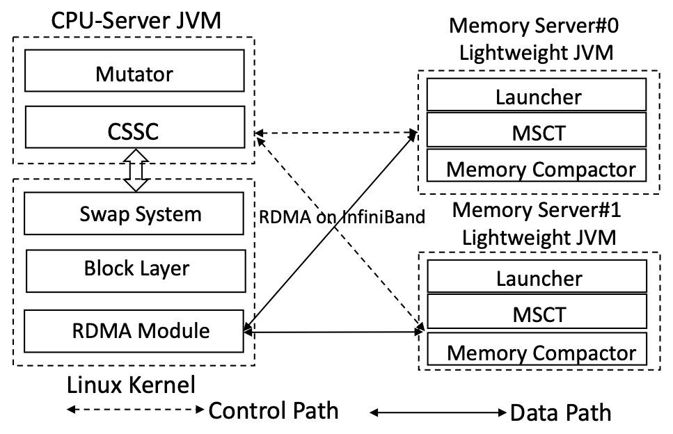

## 1. Summary of Semeru

*Semeru* is a managed runtime built for a memory disaggregated cluster where each managed application uses one CPU server and multiple memory servers. When launched on *Semeru*, the process runs its application code (mutator) on the CPU server, and the garbage collector on both the CPU server and memory servers in a coordinated manner. Due to task offloading and moving computation close to data, *Semeru* significantly improves the locality for both the mutator and GC and, hence, the end-to-end performance of the application. Please refer to our OSDI'20 paper **[Semeru: A Memory-Disaggregated Managed Runtime](https://www.usenix.org/system/files/osdi20-wang.pdf)** for more details.

Except for the stable version, We also maintain an active development version repo, *[Semeru-dev](https://github.com/wangchenxi7/Semeru-dev.git)*. 

## 2. Setup environments

- **Hardware: Intel servers with InfiniBand**
- **Kernel environments:  Linux-4.11-rc8**
- **OS versions: CentOS 7.5(7.6) with MLNX-OFED 4.3(4.5),  Ubuntu 18.04 with MLNX 4.7**
- **Run-time environments: OpenJDK 11 or 12.02**
- **GNU environments: GCC 4.8 to GCC 5.5, GLIBC 2.27**
- **Code licenses: The GNU General Public License (GPL)**

## 3. Description

*Semeru* contains the following three components:

- the Linux kernel, which includes a modified swap system, block layer and a RDMA module

- the CPU-server Java Virtual Machine (JVM)

- the Memory-server lightweight Java Virtual Machine (LJVM)

  These three components and their relationships are illustrated in figure below:
  
  

 

 

## 4. Deploying Semeru

### Build and install kernel on CPU server
#### Prerequisite
Modify `/etc/default/grub` and append to `GRUB_CMDLINE_LINUX_DEFAULT` with
```
transparent_hugepage=madvise
```
Modify `Semeru/linux-4.11-rc8/include/linux/swap_global_struct.h` as desired, e.g.
```
//#define ENABLE_SWP_ENTRY_VIRT_REMAPPING 1

#define RDMA_DATA_REGION_NUM 8UL // default 32GB

// Scatter/Gather support
// Please confirm the max number of scatter-gather packets supported by your InfiniBand.
// If you are not sure the exact number of the MAX_REQUEST_SGL, please set it to 3.
#define MAX_REQUEST_SGL 19
```
Build and Install kernel
```
cd Semeru/linux-4.11-rc8
sudo bash build_kernel.sh build
# `grub_boot_verion` may need to be changed to boot with the correct kernel
# use `uname -a` after reboot to see whether the correct kernel is booted
sudo bash build_kernel.sh install
sudo reboot
```

### Install OFED driver on CPU and MEM server
```
sudo mount -o ro,loop MLNX_OFED_LINUX-4.5-1.0.1.0-ubuntu18.04-x86_64.iso /mnt
sudo /mnt/mlnxofedinstall --add-kernel-support
sudo /etc/init.d/openibd restart
```
Config ip with `sudo ifconfig ib0 xxx.xxx.xxx.xxx up` and test with `ibstat` and `rping`.

### Build and install RDMA module on CPU server
#### Configure the number and memory resources of memory servers
Take 2 memory servers as example. Set the MACRO variables in `Semeru/linux-4.11-rc8/include/linux/swap_global_struct.h`. Adjust the number of memory servers and the Regions will be divided into each memory server evenly
```
#define NUM_OF_MEMORY_SERVER 2UL
```
And then, each memory server contains 1 Meta Region and 4 Data Regions.  
#### Add the IP of each MEM server
In `Semeru/linux-4.11-rc8/semeru/semeru_cpu.c`, e.g., the Infiniband IPs of the 2 memory servers are 10.0.0.2 and 10.0.0.4
```
char * mem_server_ip[] = {"10.0.0.2","10.0.0.4"};
uint16_t mem_server_port = 9400;
```
#### Build the Semeru RDMA module
```
cd Semeru/linux-4.11-rc8/semeru
make
```
### Build and install JVM
#### Prerequisite
```
sudo apt install zip unzip libx11-dev libxext-dev libxrender-dev libxrandr-dev libxtst-dev libxt-dev libcups2-dev libfontconfig1-dev libasound2-dev
```
Set boot jdk `Semeru/CPU-Server/build_cpu_server.sh`. Use OpenJDK11 or 12 is OK.
```
boot_jdk=''
```
#### On CPU server
`${build_mode}` can be one of the three modes:
`slowdebug`, `fastdebug`, or `release`.
We recommend slowdebug mode to debug the JVM code and release mode to test the performance.
Please make sure both the CPU server and memory servers use the same build mode.
```
cd Semeru/CPU-Server/
bash build_cpu_server.sh ${build_mode}
bash build_cpu_server.sh build
```
Take release mode as example — the compiled JVM will be in:
`Semeru/CPU-Server/build/linux-x86_64-server-release/jdk`

#### On MEM server
##### Change the IP address
E.g., mem-server 0’s IP is `10.0.0.2`, memory server ID is `0`. Change the IP address and ID in file `Semeru/Memory-Server/src/hotspot/share/utilities/globalDefinitions.hpp`
```
#define NUM_OF_MEMORY_SERVER 1
#define CUR_MEMORY_SERVER_ID 0
static const char cur_mem_server_ip[] = "10.0.0.2";
static const char cur_mem_server_port[]= "9400";
```
##### Set RDMA queue size
Larger or equal to the online core of CPU server, `Semeru/Memory-Server/src/hotspot/share/runtime/rdma_comm.hpp`
```
#define RDMA_QUEUE_NUM  80
```
##### Build and install the LJVM
Use the same ${build_mode} as the CPU-server JVM.
```
cd Semeru/Memory-Server/
bash build_memory_server.sh ${build_mode}
bash build_memory_server.sh build
```
The JDK is under now under `Semeru/Memory-Server/build/linux-x86_64-server-${build_mode}/jdk`  

Set `JAVA_HOME` to point to the folder.

### Run applications
#### Launch MEM server
Use the shell script to run each memory server. `${execution_mode}` can be `execution` or `gdb`.
```
sudo apt install numactl
cd Semeru/ShellScript
export JAVA_HOME=Semeru/Memory-Server/build/linux-x86_64-server-${build_mode}/jdk
export SEMERU_HOME="<path to Semeru>"
bash run_rmem_server_with_rdma_service.sh Case1 execution
```
#### Connect CPU server with MEM server
The default size of remote memory server is 36GB: 4GB meta region and 32GB data regions.
If not, assign the data regions size to the parameter 
in `Semeru/ShellScript/install_semeru_module.sh`
```
SWAP_PARTITION_SIZE="32G"
```
We don't recommend to change the Java heap size right now.
Please refer to the Known Issues chapter for more details.  
Set `home_dir` in `Semeru/ShellScript/install_semeru_module.sh`
```
cd Semeru/ShellScript/
bash install_semeru_module.sh semeru
```
To close the swap partition, do the following
```
bash install_semeru_module.sh close_semeru
```
If the memory servers are crashed, the CPU server should disconnect with the memory servers automatically.
In this case, we recommend to reboot the CPU server for performance test.
Because the crash of memory servers may cause kernel memory leak of CPU server.

#### Limit CPU server cache size for application with Cgroup
E.g., Create a cgroup with 8GB memory limitation. The shellscript will create a cgroup, named as memctl.
```
cd Semeru/ShellScript
# parameters <create/delete>  <cgroup_name> <memory size>
./cgroupv1_manage.sh create memctl 8g
# Or delete the cgroup
./cgroupv1_manage.sh delete memctl
```

#### Add a Spark executor into the created Cgroup
Add a Spark worker into the cgroup, memctl. Its sub-process, executor, falls into the same cgroup.
Modify the function `start_instance` under
`Spark/sbin/start-worker.sh`
```
cgexec --sticky -g memory:memctl "${SPARK_HOME}/sbin" /sparkdaemon.sh start $CLASS $WORKER_NUM -webui-port "$WEBUI_PORT" $PORT_FLAG $PORT_NUM $MASTER "$@"
```
We also recommend that only run the executor on the CPU-Server JVM.
Please refer to the FAQ chapter for more details.
In order to achive this, specify the executor JVM in `Spark/conf/spark-defaults.conf`
```
spark.executorEnv.JAVA_HOME=<semeru_cpu_server_jvm_dir>/jdk
```

More explanation
1. We recommend to only add a single process into the cgroup.
E.g., Only add the Spark Executor into process, but not adding the worker process.
   1. Keep the `Spark/sbin/start-slave.sh` unmodified
   2. Run `Semeru/ShellScript/cgroupv1_add_executor.sh` before launch the Spark app.
2. We recommend to reserve core#0 for Control Path 
E.g., modify the `Spark/sbin/start-slave.sh` to use core#1 to core#15 only:
```
taskset -c 1-15  "${SPARK_HOME}/sbin"/spark-daemon.sh start $CLASS $WORKER_NUM \
    --webui-port "$WEBUI_PORT" $PORT_FLAG $PORT_NUM $MASTER "$@"
```

#### Launch a Spark application
Start spark master on CPU server and submit a job
```
bash Spark/sbin/start-all.sh
# stop cmd
bash Spark/sbin/stop-all.sh
```
Some Semeru JVM options need to be added for both CPU-server JVM and LVJMs. CPU-server JVM and memory server LJVMs should use the same value for the same JVM option.
```
# E.g., under the configuration of 25% local memmory
# 512MB Java heap Region

# @CPU server
-Xms32g -XX:+SemeruEnableMemPool -XX:SemeruLocalCachePercent=25 -XX:EnableBitmap -XX:-UseCompressedOops -Xnoclassgc -XX:G1HeapRegionSize=512M -XX:MetaspaceSize=0x10000000 -XX:RebuildThreshold=80 -XX:G1RSetRegionEntries=4096 -XX:MaxTenuringThreshold=3 -XX:+UseG1GC -XX:ParallelGCThreads=32 -XX:TLABSize=4096 -Xlog:gc*,heap=info,semeru+rdma=info:semeru_cpu_gc.log

# @Each memory server
# ${MemSize}: the memory size of current memory server
# ${ConcThread}: the number of concurrent threads
-XX:SemeruEnableMemPool -XX:-UseCompressedOops -XX:SemeruMemPoolMaxSize=${MemSize} -XX:SemeruMemPoolInitialSize=${MemSize} -XX:SemeruConcGCThreads=${ConcThread} -XX:+UseG1GC -Xlog:gc*,semeru=info,semeru+rdma=info,semeru+alloc=info,semeru+mem_trace=info:semeru_mem_gc.log -Xms128M -Xmx128M -XX:SemeruMemPoolAlignment=512M -XX:ParallelGCThreads=1 -XX:-UseDynamicNumberOfGCThreads -XX:MetaspaceSize=0x10000000
```
We provide some shellscript examples for Spark applications under the directory `Semeru/ShellScrip/RunSparkApps`.
Please check their JVM parameters.

## 5. FAQ

*Semeru* is an academic proterotype to show the benefits of managing data on disaggreagted datacenters cross-layers. It does have some limitations and  we will keep updating the code of *Semeru*. If you encounter any problems, please open an issue or feel free to contact us: 

Chenxi Wang *wangchenxi@cs.ucla.edu*; 

Haoran Ma *haoranma@cs.ucla.edu*.


### 1. How many JVMs can run on the CPU server ?

At this moment, only one JVM can run on the CPU server. When launch the Spark cluster, multiple daemon processes run in the backgroud, e.g., Worker, Executors. Each process is a separate JVM process. The Worker process is used for management and the  Executor process is used for real computation. Please only let the Executor process runs on *Semeru* CPU server JVM. One Executor per CPU server. 

### 2. Which part of data can be swapped out to memory servers ?

Part of the Meta space and all the Data space (Java heap) can be swapped out to memory servers via the data path. Some meta variables can't be swapped out to memory servers, even they are used as the purpose on both the CPU server and memory servers. Because these variables contain virtual functions. For the same object instance, the virtual functions' addresses are usually different in the CPU server and memory servers. Swapping out these objects instances from CPU server to memory servers are not safe.


## 6. Known Issues

We have found some unfixed issues. Some of them are potential optimizations that can be applied. Some of them are potential bugs.  We will fix them and update the code latter.

### 1. Using too much native memory can cause Out-Of-Memory error.

In our design, only part of the Meta space and the Data space (Java heap) can be swapped out to memory servers. If the Java application uses too much native memory which exceeds the CPU server local capacity, the process will be killed by the Out-Of-Memory error. We will add a dedicated remote memory pool on the memory servers for the native memory space later.

### 2. Some meta data in CPU server JVM can be freed. 

In order to do concurrent tracing, G1 GC maintains some large data structures, e.g., the bitmap. Its size can reach up to 1/32 of the Java heap size. *Semeru* moved all the concurrent tracing to memory servers. There is no need to keep these meta data structures on the CPU server JVM. Removing them can save both time and space overhead. Warning : Please reserve 4GB CPU server memory for the meta regions when create the cgroup. We will fix this problem later.

### 3. Java heap size is fixed at 32GB, Start at 0x400,100,000,000.

Some meta variables are related to the Java heap size. E.g., the CPU server swap file/partition size, memory servers' alive_bitmap size etc. It's a little hard to change the Java heap size right now. We will update a new version to fix this problem later.

